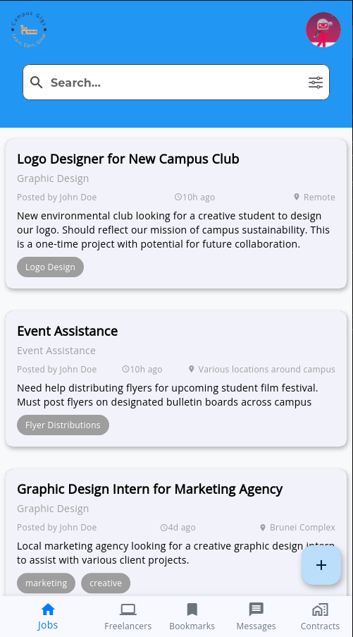
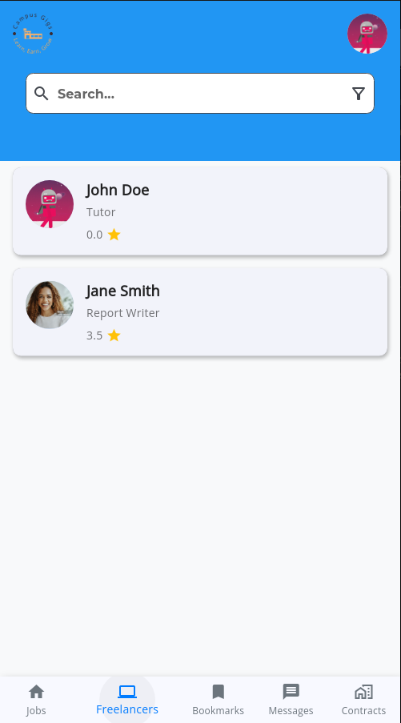
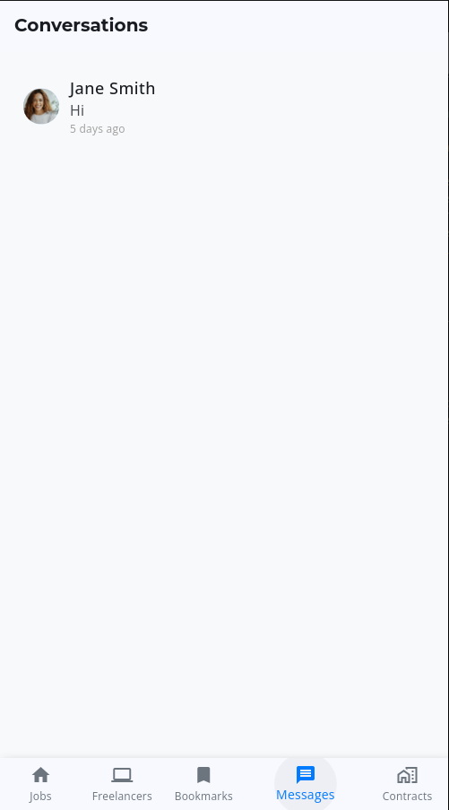
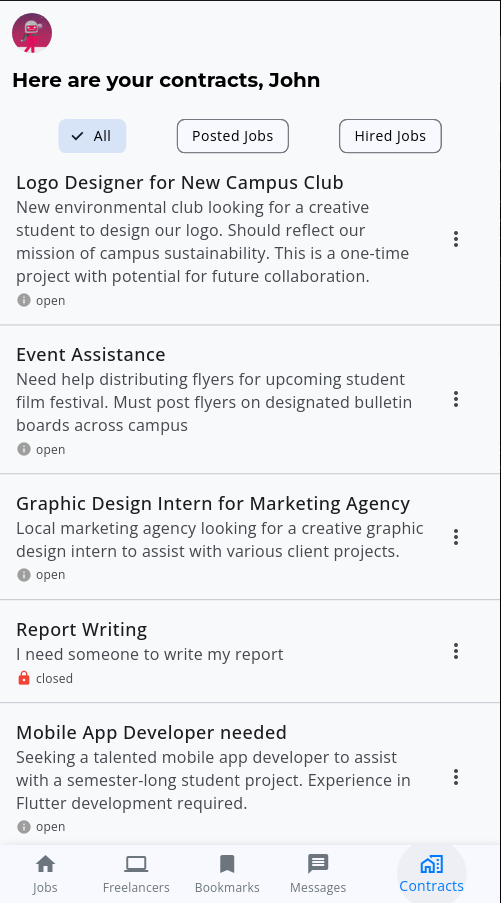

# campus_freelance_app

A new Flutter project.

## Getting Started

This project is a starting point for a Flutter application.

A few resources to get you started if this is your first Flutter project:

- [Lab: Write your first Flutter app](https://docs.flutter.dev/get-started/codelab)
- [Cookbook: Useful Flutter samples](https://docs.flutter.dev/cookbook)

For help getting started with Flutter development, view the
[online documentation](https://docs.flutter.dev/), which offers tutorials,
samples, guidance on mobile development, and a full API reference.

Sure! Here's an impressive README file for your campus freelance app built with Flutter and Firebase:

---

# Campus Freelance App

Welcome to the **Campus Freelance App**! This app is designed to connect freelancers with job opportunities within a campus environment. With an easy-to-use interface, students can find job listings, bookmark jobs, message potential employers, and manage their own freelance projects. 

## Table of Contents
- [Features](#features)
- [Screenshots](#screenshots)
- [Installation](#installation)
- [Usage](#usage)
- [Contributing](#contributing)
- [License](#license)

## Features

- **Job List Screen:** Browse through available job listings posted by other students or faculty.
- **Freelancers List Screen:** View profiles of freelancers offering various services.
- **Bookmarks Screen:** Bookmark job listings you are interested in for quick access later.
- **Messaging Screen:** Communicate with potential employers or freelancers in real-time.
- **Job Management Screen:** Manage the jobs you've posted or been hired for, keeping track of your freelance projects.

## Screenshots






## Installation

To get started with the Campus Freelance App, follow these steps:

1. **Clone the repository:**

```bash
git clone https://github.com/yourusername/campus-freelance-app.git
```

2. **Navigate to the project directory:**

```bash
cd campus-freelance-app
```

3. **Install dependencies:**

```bash
flutter pub get
```

4. **Set up Firebase:**
    - Create a Firebase project in the [Firebase Console](https://console.firebase.google.com/).
    - Add an Android and iOS app to your Firebase project.
    - Download the `google-services.json` file for Android and `GoogleService-Info.plist` file for iOS.
    - Place these files in the appropriate directories in your Flutter project:
      - `android/app/`
      - `ios/Runner/`

5. **Run the app:**

```bash
flutter run
```

## Usage

1. **Browse Jobs:** Navigate to the Job List Screen to see available job listings. Use the search and filter options to find the perfect job.
2. **View Freelancers:** Check out the Freelancers List Screen to find potential candidates for your projects.
3. **Bookmark Jobs:** Save jobs that interest you to the Bookmarks Screen for easy access later.
4. **Message:** Use the Messaging Screen to chat with employers or freelancers in real-time.
5. **Manage Jobs:** Keep track of jobs you've posted or been hired for on the Job Management Screen.

## Contributing

We welcome contributions to improve the Campus Freelance App! To contribute:

1. Fork the repository.
2. Create a new branch (`git checkout -b feature/YourFeature`).
3. Commit your changes (`git commit -m 'Add Your Feature'`).
4. Push to the branch (`git push origin feature/YourFeature`).
5. Open a pull request.

## License

This project is licensed under the MIT License. See the [LICENSE](LICENSE) file for details.

---

Feel free to customize this README file further to suit your specific app details and preferences. Happy coding!